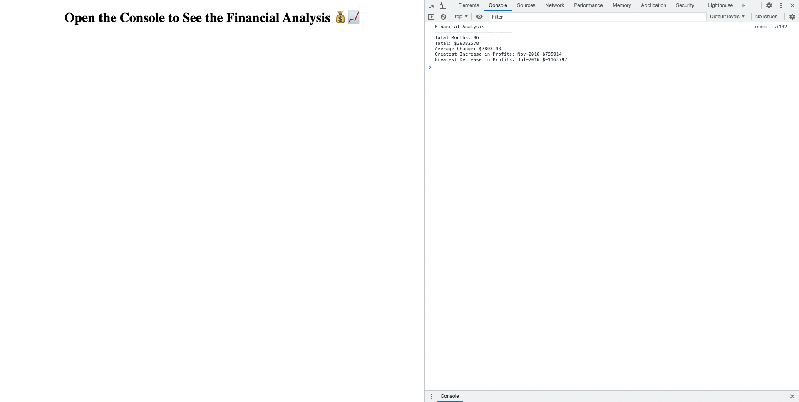

# Console-Finances
## Using JavaScript to analyse finance records

This challenge demonstrates the use of javascript to analyse financial data. It showcases how useful the Math library is for performing financial calculations.

# Challenges

The main challenge was getting my head around the structure of the data.

# Things I learned

I learnt that you can use the spread operator to expand an array into its elements whereby making it easy to operate on the elements. Another key thing I learnt was the arrow function expression which allows you to 'prototype' a function. Essentially creating a function on the fly!

# Website Screenshot

# Installation

N/A

# Usage

To use this [website](https://percyjacks.github.io/Console-Finances/), check the console to see the output for the Finance Analysis.

# Credits

N/A

# License

Please refer to the LICENSE in the repo.

# Contact

If you have any questions, please contact me at:

Github: [PercyJacks](https://github.com/PercyJacks)
